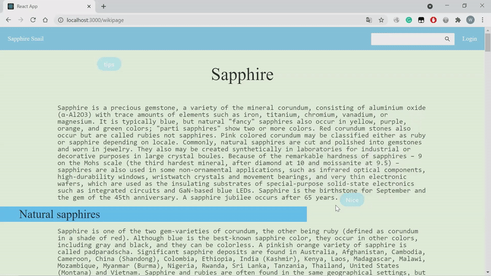

# Group-18-Sapphire-Snail

Sapphire snail is a social online search forum based on Wikipedia. It enables users to read relevant knowledge and comment on text information at the same time. The software and its contents are only used by CompSci 732 assignment. 

Sapphire snail is determined to build a social Wikipedia forum that can interact with
each other. The project was founded by Chloe, Tom, Yvonne and Winona, members of group
18. Now a complete web app is provided, users can get social interaction in the process
of reading through comments. 

### A minimal forum application built with the following technologies
* [React](https://facebook.github.io/react/)
* [Node.js](https://nodejs.org/)
* [ExpressJS](https://expressjs.com/)
* [MongoDB](https://www.mongodb.com/)
* [Jest](https://jestjs.io/)
* [Wiki API](https://en.wikipedia.org/w/api.php)

### Application Features
* Users can search on this forum, which is linked to wiki database
* Users can register and sign in the forum
* Users can post a comment
* Users can take notes on this forum

### Documentations
* [API Docs](https://github.com/csdoris/Group-18-Sapphire-Snail/blob/main/frontend_/src/api/axios.js)

### Home View

### Add Comment

### Add Note

## Deploy on you own server

Please make sure you have following software installed in your system:
* Node.js > 6.0
* NPM / Yarn (sometimes NPM is not working or cannot be installed properly, then you could use yarn)
* Git
* MongoDB

To prepare this project, we need to clone the repository: 
    `$ git clone https://github.com/csdoris/Group-18-Sapphire-Snail`

To start this project: 
First, we need to connect to the database: 
    `$ mongodb+srv://<username>:<password>@cluster0.yxtjp.mongodb.net/test` 
(Don't forget to change <username> and <password> into your username and password for mongodb) 
    
Then we can test this project(optional): 
if npm: 
    `$ npm install` 
    `$ npm run test`

if yarn: 
    `$ yarn install` 
    `$ yarn run test`

Secondly, we need to run backend: 
    direct to backend folder 
    `$ cd backend_`

Then we have to install the necessary dependencies using either NPM or Yarn: 

if npm: 
1. install npm: 
`$ npm install`
2. start nodemon: 
`$nodemon server`

if yarn: 
1. install yarn: 
`$ yarn install`
2. start nodemon: 
`$nodemon server`

Then, we need to run frontend: 
direct to frontend folder 
    `$ cd frontend_`

if npm: 
1. install npm: 
`$ npm install`
2. run the app in production environment: 
`$ npm run start`

if yarn: 
1. install yarn: 
`$ yarn install`
2. run the app in production environment: 
`$ yarn run start`

## Zoom Meeting Summary: 
#### 3/21 
Number of participants: Full participation 
Meeting minutes: 
In this meeting, we decided on the theme of the project (Wikipedia Forum). And discussed our project needs to achieve the specific functions, the general page, related research and technology resources. 
Finally, we allocate what proposal needs to write. 
Daily group discussion:  
via WeChat project discussion group (anytime)  

#### 3/28（Project Proposal Due） 
Number of participants: Full participation 
Meeting minutes: 
In the previous time, we completed the selection of the basic information of the project and the writing of the proposal (personally). Therefore, in this meeting, we integrated and unified typesetting the proposal content of each team member. 
Daily group discussion:  
via WeChat project discussion group (anytime)，Tencent Conference（group member's private instant meeting） 
 
#### 4/4 
Number of participants: Full participation 
Meeting minutes: 
Since our team members have not been exposed to the relevant knowledge of the project (such as react, express, and MongoDB) in the previous learning process, we encountered some big problems in the development process this week. 
In this meeting, we discussed and decided that in the next few weeks (until April 18th), we will have a more comprehensive study of the knowledge required for this project. 
Daily group discussion:  
via WeChat project discussion group (anytime)，Tencent Conference（group member's private instant meeting） 
 
#### 4/11 
Number of participants: Full participation 
Meeting minutes: 
At this week's meeting, we shared and summarized the learning achievements of last week. And for this week's learning process, problems were discussed with each other, solved by most of the team members for React and MongoDB questions. However, the learning of node.js and express framework is still not enough. Therefore, we decided to focus on the knowledge related to the back end of next week's learning process. 
Daily group discussion:  
via WeChat project discussion group (anytime)，Tencent Conference（group member's private instant meeting） 
 
#### 4/18 
Number of participants: Full participation 
Meeting minutes: 
In this week's meeting, we shared and summarized the relevant knowledge needed by the back end. Through the meeting's discussion, we have a comprehensive and systematic understanding and mastery of the whole project. 
Therefore, in this meeting, we also determined the main design style and specific page classification of the front-end page of the project.  
In the next week, we will plan to complete the implementation of the project's front page. 
Project division: 
Chloe：main page 
Yvonne & Winona：Home page ，Login and Create a new account 
Tom: write readme and find background pictures 
Daily group discussion:  
via WeChat project discussion group (anytime)，Tencent Conference（group member's private instant meeting） 
 
#### 4/25 
Number of participants: Full participation 
Meeting minutes: 
In this week's meeting, we looked at the front-end pages completed by each team member. And the page style has been changed to a blue and pink page design. And unify the navigation format. 
Therefore, in the next week, we will make a second change to the front-end page based on the results discussed this week. We will also start backend implementation.
Project division: 
Chloe：main page (information & comment )，Study and use of Wikipedia API(search function ), backend about these pages and function. 
Yvonne & Winona：Home page (Added three basic page displays include about us, Q&A, contact ),  log in and create a new account, backend about these pages. 
Tom: update readme file and find background pictures & logo icon，write a project test function 
Daily group discussion:  
via WeChat project discussion group (anytime)，Tencent Conference（group member's private instant meeting） 

#### 5/2 
Number of participants: Full participation 
Meeting minutes: 
This week, we continue to integrate the front-end pages and plan to upload all our frontend files to GitHub for version control and sharing. 
Then, we determined the naming information of the database and data table in the meeting and determined that the format of the data received by the back end is JSON format.
In the next week, we mainly improve the implementation of our backend functions and test files. 
Project division: 
Chloe（main page）：Wikipedia API(search function ), Import and storage of related data（comment，intext comment） 
Yvonne & Winona (Login & create a new account)：Import and storage of related data（username, password, database connecting 
Tom: update readme file, write our project test function 
Daily group discussion:  
via WeChat project discussion group (anytime)，Tencent conference（group member's private instant meeting） 

#### 5/9(project implementation due) 
Number of participants: Full participation 
Meeting minutes: 
In the last meeting, we reviewed the whole project. We go through the functions one by one and make sure these are working in everyone’s environment. 
And the discussion and division of labor for the next presentation content. 
Daily group discussion:  
via WeChat project discussion group (anytime)，Tencent Conference（group member's private instant meeting） 

In addition to our weekly scheduled meetings, many of our discussions are held on the WeChat APP. Since our group has overseas members (with the time difference), we can share any ideas and problems we encounter through the discussion group on WeChat. In addition, we will use this discussion group to share some additional extended learning materials needed for the project, such as Wikipedia database-related information links, MongoDB using tutorials, and other types of problem-solving extended learning materials links. 
Every team member has made a good contribution to the project, and there is no case that any team member is isolated and does not participate in the project discussion. The communication form of regular meetings and APP discussion group ensures that every member of our group can communicate problems and discuss ideas in real-time.

